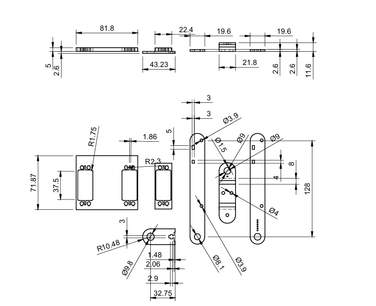
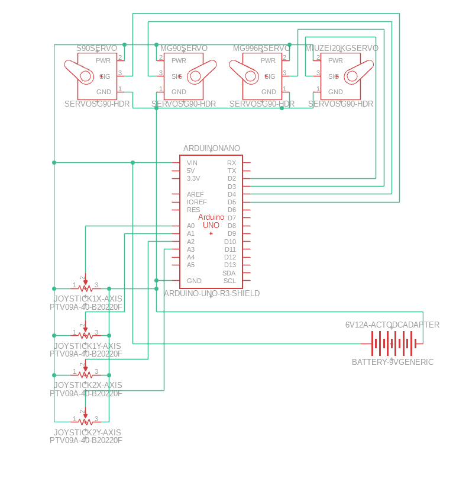

# Smooth High Torque 3-Axis Robot Controllable with a Controller

My project is a high torque 3-axis robot which is controllable via two joysticks and uses something called numerical interpolation to smooth servo motions. Along with this, it is powered by a 6V 12A power supply and is capable of picking up various objects.

| **Jayant H** | **Irvington Highschool** | **Mechanical Engineering** | **Incoming Senior** |


**Replace the BlueStamp logo below with an image of yourself and your completed project. Follow the guide [here](https://tomcam.github.io/least-github-pages/adding-images-github-pages-site.html) if you need help.**

[Headstone Image](bluestampproject.jpg)
  
# Final Milestone

<iframe width="560" height="315" src="https://www.youtube.com/embed/vt51Qg26snA?si=FuyMewWrRG-MJo21" title="YouTube video player" frameborder="0" allow="accelerometer; autoplay; clipboard-write; encrypted-media; gyroscope; picture-in-picture; web-share" referrerpolicy="strict-origin-when-cross-origin" allowfullscreen></iframe>


For my final milestone I have added the servo brackets along with an extended 3D printed wrist section in order to avoid gripper collision with the brackets. Along with this, I also used numerical interpolation for my code, that is shown if you scroll down a little on this webpage, in order to smooth servo motion. Both of these resulted in really smooth motion as compared earlier and it seems like I was right in hypothesizing that the servo quality does effect the amount of backlash and overall smoothness of the servo's motions. I think my code also helped a lot in this process aswell. Some of my main challenges were the short circuits I experienced with excess voltage, 3D printing tolerances, and coding the arm but by far I think the hardest challenge to overcome and what my project eventually spiraled into fixing was the robot spazzing out. I initally just wanted to add another joint for more freedom on the robot arm but after considering the weight limit and spazzing out that the arm had I eventually dove completely into solving these issues until I fixed it with higher torque servos and numerical interpolation. The main topics that I learned about were numerical interpolation (explained in Milestone 2), how to code, the relationship between voltage and amps, organization, stall torque, and detente torque. In the future, I really just want to learn literally everything about engineering (Linear Algebra, Fluid Mechanics, Bending Moments, Multivariable Calculus, Thermodynamics, Maxwell's equations, etc..) as I have this neverending thirst for knowledge that I feel can only be satiated through just learning everything. I really love engineering and Bluestamp provided the perfect learning ground to improve my engineering knowledge. 


# Second Milestone

**Don't forget to replace the text below with the embedding for your milestone video. Go to Youtube, click Share -> Embed, and copy and paste the code to replace what's below.**

<iframe width="560" height="315" src="https://www.youtube.com/embed/C04c24L3rZs?si=wcfEC1ZqMgOoWi13" title="YouTube video player" frameborder="0" allow="accelerometer; autoplay; clipboard-write; encrypted-media; gyroscope; picture-in-picture; web-share" referrerpolicy="strict-origin-when-cross-origin" allowfullscreen></iframe>

I have added the 2 high torque servos (an MG996R servo and a Miuzei 20kg servo) at the shoulder and elbow joints and I've started to code something to smooth servo motions through a method called numerical interpolation. Essentially, there are an infinite amount of points between two points and an infinite amount of ways to get between those two points. So, essentially, what numerical interpolation does is that it uses a velocity function of sorts to create the different "steps" needed to give the illusion of smooth servo motion. I can also make it simulate different types of interpolation. For example, I can use quadratic or sinusoidal or exponential..etc.. Going back to the more mechanical aspects of this project, I attached the servos but I was surprised to find them spinning on their own axises. I figured this was due to an inability to counteract the reactive forces within a motor and so I plan to add servo brackets to my design in the future. I overcame the base jamming as it turns out it was just a result of overtightening the servo screw. I also think my hypothesis on servo smoothness depending on the quality of servo was correct as when I tried to hold the motors in place and then move the arm it seemed to rotate the joint with minimal wobble and no spazzing. For my final milestone, I need to complete the servo brackets for my arm along with the numerical interpolation code for the robot.


# First Milestone

**Don't forget to replace the text below with the embedding for your milestone video. Go to Youtube, click Share -> Embed, and copy and paste the code to replace what's below.**

<iframe width="560" height="315" src="https://www.youtube.com/embed/Fcs9LTFBgY0?si=erYTSkbg2V_--Qbf" title="YouTube video player" frameborder="0" allow="accelerometer; autoplay; clipboard-write; encrypted-media; gyroscope; picture-in-picture; web-share" referrerpolicy="strict-origin-when-cross-origin" allowfullscreen></iframe>


I plan for this project to become a 4-axis robot with a 4th axis on the wrist. I also plan to fix various bugs with the robot spazzing out. My project includes 3 SG90 Servo motors and an MG996R Servo for the base roundtable. It also includes various acrylic pieces for the robot chassis, an acrylic wrist module, and several screws and threaded pieces. So far, I've put together the robot and it is now capable of functioning however the base roundtable frequently jams and the robot seems to spazz out weirdly. Along with this, the various modules of the arm stop really abruptly causing a large momentum transfer to the entire robot (basically causing it to rock back and forth at any quick joint movement. I also broke one of the pieces that came with the kit so I had to 3D print and CAD a replica piece for the base in order to fix this issue. My dreams of adding a 4th axis must be put on hold for now as I've noticed, after testing, that my base module is practically at its limit torque wise so adding extra weight would make it dysfunctional. I plan to add higher torque servos for the base so that I can mount my planned 4th axis and also so, or so I hypothesize, that my arm is able to resist more quick movements and the momentum transfer as a result of those quick movements. I also plan to fix the issue with the base jamming of which I am still unsure of what causes this malfunction.


# Schematics 
      
# Code

```c++
#include <Arduino.h>    
#include <Servo.h>
#include <Ramp.h>

int dz = 30; //deadzone


Servo Base;
Servo Shoulder;
Servo Elbow; 
Servo Gripper;

ramp Rbase;
ramp Rshoulder;
ramp Relbow;
ramp Rgripper;


int velocity = 60;

float oldBase = 90;
float oldShoulder = 90;
float oldElbow = 90;
float oldGripper = 90;

float currentBase;
float currentShoulder;
float currentElbow;
float currentGripper;

float joystickPin;         
float Joystick;     


float duration;

int JoystickCheck() {
 // Serial.println(2);
  if (abs(analogRead(0)-512) > dz){
    return 0;
  } else if (abs(analogRead(1)-512) > dz) {
    return 1;
  } else if (abs(analogRead(2)-512) > dz){
    return 2;
  } else if (abs(analogRead(3)-512) > dz) {
    return 3;
  } else {
    return JoystickCheck();
  }
}


void JoystickUpdate() {
  //Serial.println(3);
  joystickPin = JoystickCheck(); 
  Joystick = analogRead(joystickPin);
  Joystick = map(Joystick, 0, 1023, 0, 180 );
  if (joystickPin == 0) {
  duration = min(1000*(abs(Joystick-oldBase))/velocity,800); 
  Rbase.go (Joystick,duration,EXPONENTIAL_OUT, ONCEFORWARD);  //starts interpolation towards that point
  //Serial.println(currentBase);
} else if (joystickPin == 1) {
  duration = min(1000*(abs(Joystick-oldShoulder))/velocity,800); 
  Rshoulder.go (Joystick,duration,EXPONENTIAL_OUT, ONCEFORWARD);
} else if (joystickPin == 2) {
  duration = min(1000*(abs(Joystick-oldElbow))/velocity,800); 
  Relbow.go (Joystick,duration,EXPONENTIAL_OUT, ONCEFORWARD);
} else if (joystickPin == 3) {
  duration = min(1000*(abs(Joystick-oldGripper))/velocity,800); 
  Rgripper.go (Joystick,duration, CUBIC_OUT, ONCEFORWARD);
} else  {
  return JoystickCheck();
} 
 
}
void servoUpdate() {
//Serial.println(4);
   currentBase = Rbase.update();
  currentShoulder = Rshoulder.update();
  currentElbow = Relbow.update();
  currentGripper = Rgripper.update();
  //Serial.println(joystickPin);
 if (joystickPin == 0 && abs(currentBase-oldBase) >= 2) {
  Base.write(round(currentBase));
  oldBase = currentBase;
} else if (joystickPin == 1 && abs(currentShoulder-oldShoulder) >= 2) {
  Shoulder.write(round(currentShoulder));
  oldShoulder = currentShoulder;
} else if (joystickPin == 2 && abs(currentElbow-oldElbow) >= 2) {
  Elbow.write(round(currentElbow));
  oldElbow = currentElbow;
} else if (joystickPin == 3 && abs(currentGripper-oldGripper) >= 2) {
  Serial.println(currentGripper);
  Gripper.write(round(currentGripper));
  oldGripper = currentGripper;
} else  {
  return;
} 


}


void setup() {
  Serial.begin(9600);
  //Serial.println(1);
 Rbase.setGrain(20);
 Rshoulder.setGrain(20);
 Relbow.setGrain(20);
 Rgripper.setGrain(20);

  Base.attach(4);
  delay(10);
  Shoulder.attach(5);
  delay(10);
  Elbow.attach(6);
  delay(10);
  Gripper.attach(7);
  
  Base.write(90);
  Shoulder.write(90);
  Elbow.write(90);
  Gripper.write(90);
}


void loop() {
 JoystickUpdate();
 delay(100);
 //Serial.println(duration);
 servoUpdate();
 
 
 
 
}

```

# Bill of Materials

| **Part** | **Note** | **Price** | **Link** |
|:--:|:--:|:--:|:--:|
| Robot Arm for Arduino, Smart Robot Building Kit That can Memorize and Repeat Movements for Beginners/Teens/Adults to Learn Electronic, Programming, Math and Science | Robotic Arm Base Structure | $50 | <a href="https://www.amazon.com/LK-COKOINO-Compliment-Engineering-Technology/dp/B081FG1JQ1"> Link </a> |
| Deegoo [4-Pack] MG996R 55g Metal Gear Torque Digital Servo Motor for Futaba JR RC Helicopter Car Boat Robot| High Torque Servo to Control Joints | $17 | <a href="https://a.co/d/8p3nLpP"> Link </a> |
| Miuzei 20KG Servo Motor High Torque RC Servo Metal Gear Waterproof for 1/8, 1/10, 1/12 R/C Model DIY Car Robot, DS3218, Control Angle 270°  | High Torque Servo to Control Joints | $13 | <a href="https://a.co/d/g62aGua"> Link </a> |
| 3~12V 12A 144W Adjustable Universal Power Supply Adapter, 3V 4V 5V 6V 7V 8V 9V 10V 11V 12V Variable DC Power Supply with Voltage Display 100V-240V 50-60Hz AC to DC Converter for LED Strip Light Router | Power Supply | $31 | <a href="https://a.co/d/ez9R1xw"> Link </a> |
| Arduino Nano | Microcontroller| $25 | <a href="https://a.co/d/1AVNpgq"> Link </a> |
| EBOOT T8 Repair Screwdriver Compatible with Xbox One, Xbox 360 Controller and PS3, Blue | Screwdriver | $6.50 | <a href="https://www.amazon.com/Screwdriver-Xbox-One-360-Controller-PS3/dp/B01ESPNBB2"> Link </a> |
| ELEGOO 120pcs Multicolored Dupont Wire 40pin Male to Female, 40pin Male to Male, 40pin Female to Female Breadboard Jumper Ribbon Cables Kit Compatible with Arduino Projects | Wire Extensions | $7 | <a href="https://a.co/d/5ya6PP6"> Link </a> |
| 1760pcs M2 M3 M4 M5 Metric Screw Assortment, Grade 12.9 Alloy Steel Hex Socket Head Cap Bolts and Nuts Kit, Black Zinc Plated and Anti Rust Screw Set with 4 pcs Hex Wrenches | Nuts and Bolts for 3D Printed Mods | $26 | <a href="https://a.co/d/eawcq2k"> Link </a> |
| HiLetgo 5pcs Nano I/O Expansion Sensor Shield for Arduino UNO R1 Nano 3.0 Duemilanove 2009 | Servo Shield | $11 | <a href="https://a.co/d/fAJERyY"> Link </a> |

